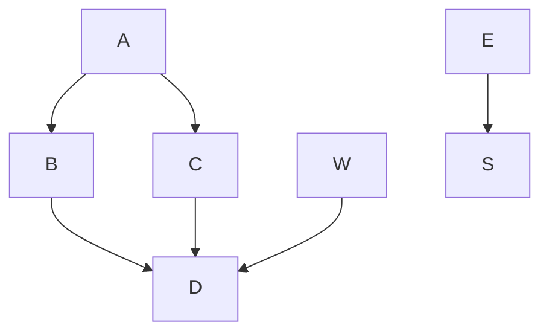

# wiki-mermaid

## notes

il faut avoir un répertoire `output/`

[à propos du GITHUB_TOKEN](https://docs.github.com/en/actions/reference/authentication-in-a-workflow)

## exemple

Here is an inline mermaid file

