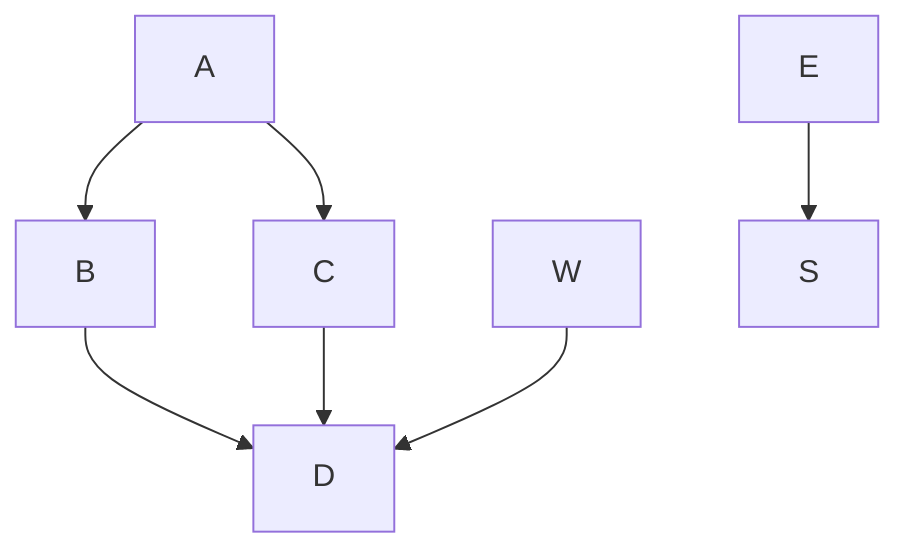

# wiki-mermaid

Here is an inline mermaid file

<!-- generated by mermaid compile action - START -->

  
Mermaid markup

```mermaid
graph TD;
    A-->B;
    A-->C;
    B-->D;
    C-->D;
    W-->D;
    E-->S;
```

<!-- generated by mermaid compile action - END -->
