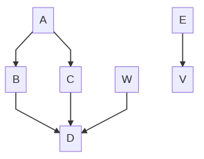

# wiki-mermaid

## notes

il faut avoir un répertoire `output/` non vide...

[à propos du GITHUB_TOKEN](https://docs.github.com/en/actions/reference/authentication-in-a-workflow)

[PB](https://githubmemory.com/repo/yaSebastian/mermaid-markdown-test/issues) résolu en ajoutant `git add .` dans le step  **Commit files** de l'action.

Ici la GitHub action push directement les modifications dans le repo. 

Lors d'un push, si les graphes mermaid n'ont pas bougé, alors le step **Commit files** tombe en erreur avec :
```
nothing to commit, working tree clean
Error: Process completed with exit code 1.
```
et la GitHub action ne push rien.

On peut aussi faire une GitHub action qui génère une PR avec les modifications,
cf [https://github.com/marketplace/actions/compile-mermaid-markdown#sample-workflow-with-automated-pr](https://github.com/marketplace/actions/compile-mermaid-markdown#sample-workflow-with-automated-pr)

## exemple

Here is an inline mermaid file

<!-- generated by mermaid compile action - START -->

<details>
  <summary>Mermaid markup</summary>


</details>
<!-- generated by mermaid compile action - END -->
